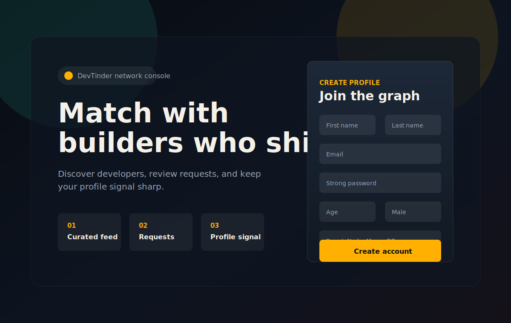
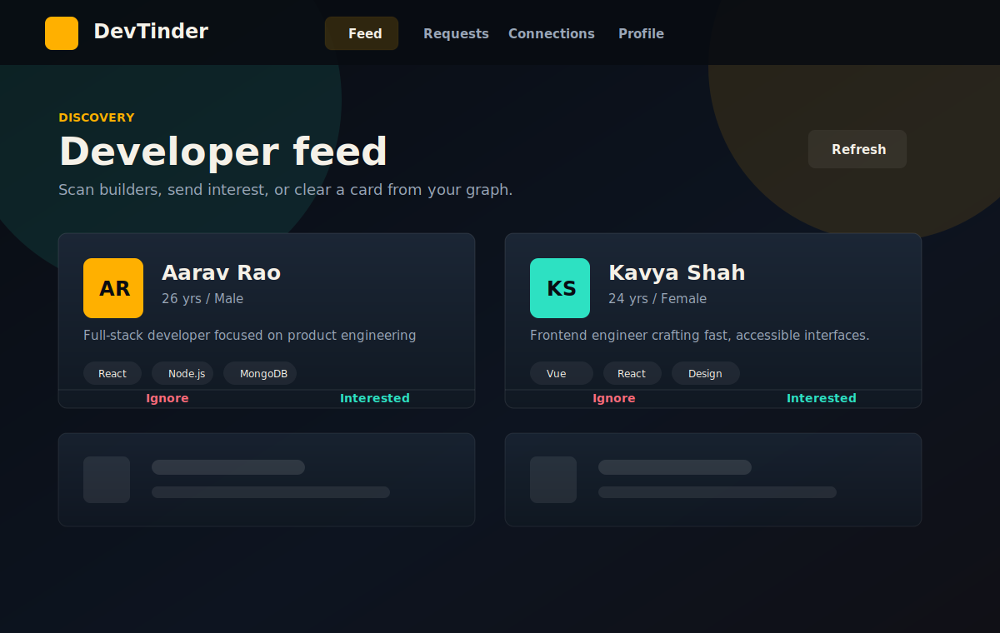
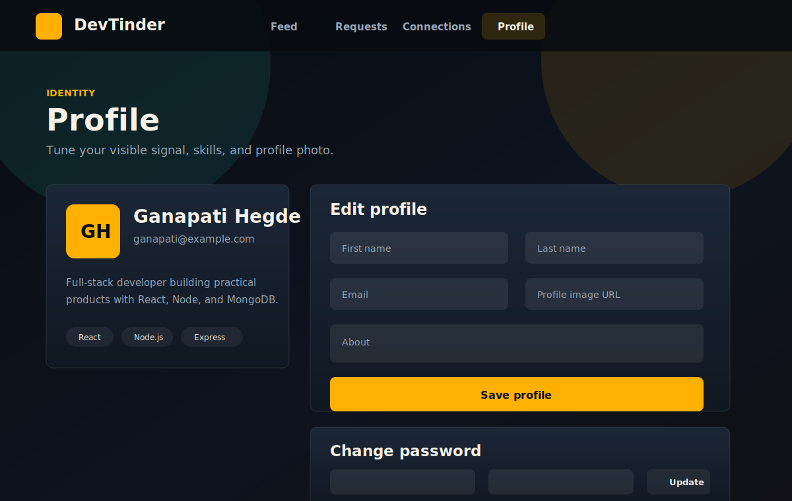

<div align="center">

# DevTinder

### A full-stack developer networking app for discovering builders, sending interest, reviewing requests, and managing your profile.

[](https://react.dev/)
[](https://vite.dev/)
[](https://expressjs.com/)
[](https://mongoosejs.com/)

</div>

## Preview

| Auth | Developer Feed | Profile |
| --- | --- | --- |
|  |  |  |

## About

DevTinder is a MERN-style social discovery app built for developers. Users can create an account, sign in with cookie-based JWT auth, browse a protected developer feed, send interest or ignore profiles, review incoming requests, view accepted connections, and update profile details.

The project is organized as a monorepo:

```text
devTinder/
  backend/   Express API, MongoDB models, auth, profile, feed, requests
  frontend/  Vite React app, Tailwind CSS v4, protected app shell
```

## Features

- Account signup, login, logout, and authenticated profile lookup
- JWT authentication stored in an HTTP-only `token` cookie
- Protected frontend routes for feed, requests, connections, and profile
- Developer feed with pagination and hidden already-reviewed users
- Send `interested` or `ignore` connection requests
- Accept or reject incoming requests
- View accepted connections
- Edit profile information, profile image URL, about text, and skills
- Change password with current-password verification
- Responsive dark UI built with React, Tailwind CSS, and Lucide icons

## Tech Stack

| Layer | Tools |
| --- | --- |
| Frontend | React 19, Vite 7, React Router, Tailwind CSS v4, Lucide React |
| Backend | Node.js, Express 5, Mongoose, MongoDB |
| Auth | JWT, bcrypt, cookie-parser |
| Validation | validator.js, Mongoose schema rules |

## API Overview

### Auth

```http
POST /signup
POST /login
POST /logout
```

### Profile

```http
GET   /profile
PATCH /profile/edit
PATCH /profile/password
```

### Feed and Connections

```http
GET  /feed?page=&limit=
GET  /user/requests/received
GET  /user/requests/connections
POST /request/send/:status/:toUserId
POST /request/review/:status/:requestId
```

## Getting Started

### 1. Clone the repo

```bash
git clone https://github.com/GanapatiHegde01/DevTinder.git
cd DevTinder
```

### 2. Install backend dependencies

```bash
cd backend
npm install
```

### 3. Install frontend dependencies

```bash
cd ../frontend
npm install
```

### 4. Start the backend

From `backend/`:

```bash
npm run dev
```

The API runs on:

```text
http://localhost:7777
```

### 5. Start the frontend

From `frontend/`:

```bash
npm run dev
```

The app runs on:

```text
http://localhost:5173
```

## Local Configuration Notes

- The frontend API base URL defaults to `http://localhost:7777`.
- Backend CORS currently allows `http://localhost:5173` and `http://127.0.0.1:5173`.
- Auth requests must include credentials because the backend uses cookies.
- For production use, move secrets such as MongoDB connection strings and JWT secrets into environment variables.

## Useful Scripts

### Backend

```bash
npm run dev
npm start
```

### Frontend

```bash
npm run dev
npm run build
npm run lint
```

## Project Highlights

- `backend/src/routes/auth.js` handles signup, login, logout, password hashing, and safe user response shaping.
- `backend/src/routes/user.js` powers the feed, received requests, and accepted connections.
- `backend/src/routes/connection.js` manages send/review request workflows.
- `frontend/src/App.jsx` contains the protected app shell, auth screens, feed cards, request review, connections, and profile editing.
- `frontend/src/lib/api.js` centralizes API calls with `credentials: "include"`.

## Roadmap Ideas

- Move backend secrets into `.env`
- Add image upload support instead of URL-only profile photos
- Add real-time notifications for incoming requests
- Add search and filters for skills, age, and gender
- Add automated backend route tests and frontend component tests

---

<div align="center">

Built as a practical full-stack learning project with a polished developer-networking workflow.

</div>
